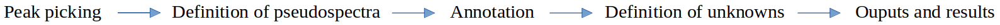
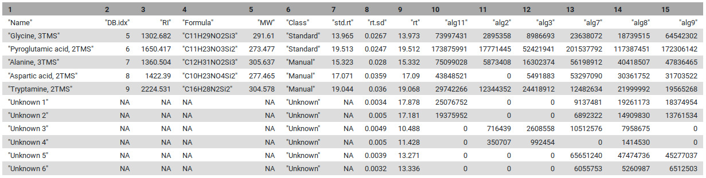
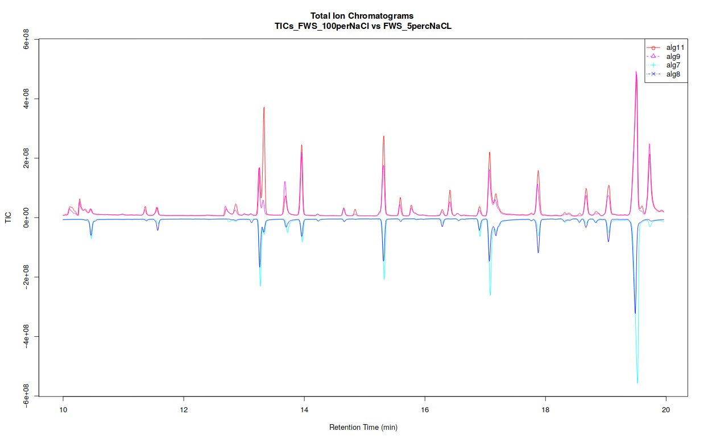
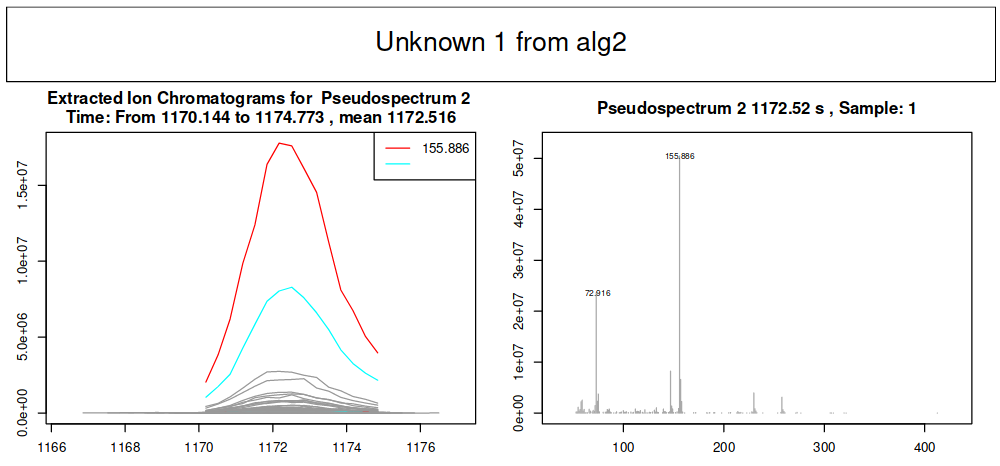

---
layout: tutorial_hands_on
draft: true

title: 'Mass spectrometry : GC-MS analysis with metaMS package'
level: Introductory
zenodo_link: 'https://zenodo.org/record/3631074' 
questions: 
- What are the main steps for gas chromatography-mass spectrometry (GC-MS) data processing for untargeted metabolomic analysis?
- How to conduct metabolomic GC-MS data analysis from preprocessing to annotation using Galaxy?
objectives: 
- To be sure you have already comprehend the diversity of MS pre-processing analysis. 
- To learn the principal functions of metaMS package for GC-MS data processing through Galaxy.
- To evaluate the potential of a workflow approach and available Galaxy tools when dealing with GC-MS metabolomic analysis. 
time_estimation: 2H 
key_points: 
- To process untargeted GC-MS metabolomic data preprocessing, you need a large variety of steps and tools.
- Although main steps are standard, various ways to combine and to set parameters for tools exist, depending on your data.
- Resources are available in Galaxy, but do not forget that you need appropriate knowledge to perform a relevant analysis. 
requirements:
- type: "internal"
  topic_name: metabolomics
contributors: 
    - jsaintvanne
    - yguitton
    - melpetera
    - workflow4metabolomics
funding:
- elixir-europe
    
--- 

You may already know that there are different types of *-omic* sciences; out of these, metabolomics is most closely related to phenotypes.
Metabolomics involves the study of different types of matrices, such as blood, urine, tissues, in various organisms including plants. It  focuses on studying the very small molecules
which are called *metabolites*, to better understand matters linked to the metabolism. However, studying metabolites is not a piece of cake
since it requires several critical steps which still have some major bottlenecks. Metabolomics is still quite a young science, and has many
kinds of specific challenges.

One of the three main technologies used to perform metabolomic analysis is **Gas-Chromatography Mass Spectrometry** (GC-MS). Data analysis
for this technology requires a large variety of steps, ranging from extracting information from the raw data, to statistical analysis
and annotation. Many packages in R/Python are available for the analysis of GC-MS or LC-MS data - for more details see the reviews by  and .

This tutorial explains the main steps involved in untargeted **GC-MS** data processing, to do so we focus on some open-source solutions integrated within the Galaxy framework, namely **XCMS**, **metaMS**. The selected tools and functionnalities only covers a small portion of available tools but allow to **perform a complete GC-MS analysis** in a single environment.
In this tutorial, we will learn how to (1) extract features from the raw data using **XCMS** (), (2) deconvolute the detected features into spectra with **metaMS** (). 

To illustrate this approach, we will use data from . Due to time constraints in processing the original dataset, a limited subset of samples was utilized to illustrate the workflow. This subset (see details bellow) demonstrates the key steps of metabolomic analysis, from pre-processing to annotation. Although the results derived from this reduced sample size may not be scientifically robust, they provide insight into essential methodological foundations of GC-MS data-processing workflow.

> <details-title> Algae samples </details-title>
>
> The objectives of this study was to investigates the adaptation mechanisms of the brown algae Ectocarpus to low-salinity environments. The research focused on examining physiological tolerance and metabolic changes in freshwater and marine strains of Ectocarpus. Using transcriptomic and metabolic analyses, the authors identified significant, reversible changes occurring in the freshwater strain when exposed to seawater. Both strains exhibited similarities in gene expression under identical conditions; however, substantial differences were observed in metabolite profiles.
> 
> The study utilized a **freshwater strain** of Ectocarpus and a **marine strain** for comparative analysis. The algae were cultured in media with varying salinities, prepared by diluting natural seawater or adding NaCl. The algae were acclimated to these conditions before extraction.
> 
> The 6 samples used in this training were analysed by GC-MS (low resolution instrument). A marine strains raised in sea water media (2 replicats) and a freshwater strains raised either in 5 or 100% sea water media (2 replicats each). [Link](https://zenodo.org/record/3631074/)
>
{: .details}

To process the GC-MS data, we use several tools. **XCMS** () is a general R package for untargeted metabolomics profiling. It can be used for any type of mass spectrometry acquisition (centroid and profile) or resolution (from low to high resolution), including FT-MS data coupled with a different kind of chromatography (liquid or gas). Because of the generality of packages like **XCMS**, several other packages have been developed to use the functionality of **XCMS** for optimal performance in a particular context. The R package **metaMS** () does so for the field of GC-MS untargeted metabolomics. One of the goals **metaMS** was to set up a simple system with few user-settable parameters, capable of handling untargeted metabolomics experiments. 
In this tutorial we use **XCMS** to detect chromatographic peaks within our samples. Once we have detected them, they need to be deconvoluted into mass spectra representing chemical compounds. For that, we use **metaMS** functions. To normalise the retention time of deconvoluted spectra in our sample, we compute the retention index using Alkane references and a dedicated function of **metaMS**. Finally, we identify detected spectra by aligning them with a database of known compounds. This can be achieved using in-house build database in the common .msp format (used in the NIST MS search program for example), resulting in a table of identified compounds. 

> <comment-title></comment-title>
> - In Galaxy other GC-MS data processing workflows are available and may be of interest for more advanced Galaxy users [Add link]
{: .comment}

> <agenda-title></agenda-title>
>
> In this tutorial, we will cover:
>
> 1. TOC
> {:toc}
>
{: .agenda}


# Data preparation and prepocessing

Before we can start with the actual analysis pipeline, we first need to download and prepare our dataset. Many of the preprocessing steps can be run in parallel on individual samples. Therefore, we recommend using the Dataset collections in Galaxy. This can be achieved by using the dataset collection option from the beginning of your analysis when uploading your data into Galaxy.

## Import the data into Galaxy

> <hands-on-title> Upload data </hands-on-title>
>
> 1. Create a new history for this tutorial
>
>    
>
> 2. Import the files from [Zenodo]({{ page.zenodo_link }}) into a collection:
>
>    ```
>    https://zenodo.org/record/3631074/files/alg11.mzData
>    https://zenodo.org/record/3631074/files/alg2.mzData
>    https://zenodo.org/record/3631074/files/alg3.mzData
>    https://zenodo.org/record/3631074/files/alg7.mzData
>    https://zenodo.org/record/3631074/files/alg8.mzData
>    https://zenodo.org/record/3631074/files/alg9.mzData
>    ```
>
>    
>
> 3. Make sure your data is in a **collection**. You can always manually create the collection from separate files:
>
>    
>
>    In the further steps, this dataset collection will be referred to as `input` (and we recommend naming this collection like that to avoid confusion).
>
> 4. Import the following extra files from [Zenodo]({{ page.zenodo_link }}):
>
>    ```
>    https://zenodo.org/record/3631074/files/reference_alkanes.csv
>    https://zenodo.org/record/3631074/files/W4M0004_database_small.msp
>    https://zenodo.org/record/3631074/files/sampleMetadata.tsv
>    ```
>
>    
>
>
>    > <comment-title> The extra files </comment-title>
>    >
>    > The three additional files contain the **reference alkanes**, the **W4M0004_database_small**, and the **sampleMetadata**. Those files are auxiliary inputs used in the data processing and contain either extra information about the samples or serve as reference data for indexing and identification.
>    > 
>    > The **list of alkanes** (`.tsv` or `.csv`) with retention times and carbon number or retention index is used to compute the retention index of the deconvoluted peaks. The alkanes should be measured in the same batch as the input sample collection.
>    > 
>    > The **W4M0004_database_small** (`.msp`) is a reference database used for the identification of spectra. It contains the recorded and annotated mass spectra of chemical standards, ideally from a similar instrument. The unknown spectra which can be detected in the sample can then be confirmed via comparison with this library. The specific library is an in-house library of metabolite standards extracted with **metaMS** .
>    > 
>    > The **sample metadata** (`.csv` or `.tsv`) is a table containing information about our samples. In particular, the tabular file contains for each sample its associated sample name, class (SW, FWS, etc.). It is possible to add more columns to include additional details about the samples (e.g : batch number, injection order...).
>    {: .comment}
>
{: .hands_on}

As a result of this step, we should have in our history a green Dataset collection with all 6 samples `.mzData` files as well as three separate files with reference alkanes, reference spectral library, and sample metadata.

## Create the XCMS object

The first part of data processing is using the **XCMS** tool to detect peaks in the MS signal. For that, we first need to take the `.mzData` files and create a format usable by the **XCMS** tool.  (. ) takes as input our files and prepares `RData` files for the first **XCMS** step.

> <comment-title></comment-title>
> **MSnbase readMSData**  function, prior to **XCMS**, is able to read files with open format as `mzXML`, `mzML`, `mzData` and `netCDF`, which are independent of the constructors' formats. Working with open MS data file format allows users to us tools developped outside of the MS instrument provider. This set of packages/functions gives modularity, and thus is particularly well adapted to define workflows, one of the key points of Galaxy.
{: .comment}

> <hands-on-title> Create the XCMS object </hands-on-title>
>
> 1.  with the following parameters:
>    -  *"File(s) from your history containing your chromatograms"*: `input`
>
>    
>
>    > <comment-title> Output - `input.raw.RData` </comment-title>
>    >
>    > Collection of `rdata.msnbase.raw` files. `Rdata` file that is necessary in the next step of the workflow. These serve for an internal R representation of **XCMS** objects needed in the further steps.
>    {: .comment}
{: .hands_on}
>    >
>    > 

# Peak detection using XCMS

The first step in the workflow is to detect the peaks in our data using **XCMS** functions. This part, however, is covered by a [separate tutorial]({{ site.baseurl }}/topics/metabolomics/tutorials/lcms-preprocessing/tutorial.html). Although the tutorial is dedicated to LC-MS data, it can also be followed for our GC-MS data. Therefore, in this section, we do not explain this part of the workflow in detail but rather refer the reader to the dedicated tutorial. Please also pay attention to the parameter values for individual Galaxy tools, as these can differ from the referred tutorial and are adjusted to our dataset.

> <details-title> Skip this step </details-title>
> 
> Since this step is already covered in a [separate tutorial]({{ site.baseurl }}/topics/metabolomics/tutorials/lcms-preprocessing/tutorial.html), it is possible to skip it. Instead, you can continue with [Peak deconvolution]({{ site.baseurl }}/topics/metabolomics/tutorials/gcms/tutorial.html#processing-with-metams-option-1) step using a preprocessed **XCMS** object file prepared for you.
>
> > <hands-on-title> Upload data </hands-on-title>
> >
> > 1. Create a new history for this tutorial
> >
> >    
> >
> > 2. Import the following files from [Zenodo]({{ page.zenodo_link }}):
> >
> >    ```
> >    https://zenodo.org/record/3631074/files/xcms_outputs
> >    ```
> >
> >    
> >
> >    The format of uploaded file containing **XCMS** object should be `rdata.xcms.fillpeaks`.
> >
> >    
> >
> {: .hands_on}
>
{: .details}

## Peak picking

The first step is to extract peaks from each of your data files independently. For this purpose, we use the _MatchedFilter_ chromatographic peak detection algorithm implemented in .

 
One Galaxy Training material already explains how to act with MS data. We encourage you to **follow this link and complete the corresponding tutorial**: [Mass spectrometry: LC-MS preprocessing with XCMS](). 
For GC-MS analysis you **don't really need to follow all of this previous tutorial** but for a better understanding of your data, it is recommanded to try it with their test dataset.
Concerning the current GC-MS tutorial, you **just have to compute the following steps and specific parameters** described in the hands-on part below (please follow parameters values to have the same results during the training).
{: .text-justify}


> <hands-on-title>Peakpicking of GC-MS data with XCMS</hands-on-title>
>
> 1.  with the following parameters:
>    -  *"RData file"*: `input.raw.RData` (output of the **MSnbase readMSData**  job)
>    - *"Extraction method for peaks detection"*: `MatchedFilter - peak detection in chromatographic space`
>        - *"Full width at half maximum of matched filtration gaussian model peak"*: `5`
>        - *"Step size to use for profile generation"*: `0.5`
>        - In *"Advanced Options"*:
>            - *"Maximum number of peaks that are expected/will be identified per slice"*: `500`
>            - *"Signal to Noise ratio cutoff"*: `2`
>            - *"Minimum difference in m/z for peaks with overlapping Retention Times"*: `0.5`
>
>
>    > <comment-title></comment-title>
>    >
>    > With GC-MS data in profile mode, we need to use the *MatchedFilter* algorithm instead of the *Centwave* one used in the LC-MS tutorial.
>    {: .comment}
>
> 2.  with the following parameters:
>    -  *"RData file"*: `input.raw.xset.RData` (output of the **xcms findChromPeaks (xcmsSet)**  job)
>    -  *"Sample metadata file "*: `sampleMetadata.tsv` (One of the uploaded files from Zenodo)
>
>    > <comment-title></comment-title>
>    >
>    > To merge your data, you need to **input a sampleMetadata file** containing filenames and their metadata informations like their class for example.
>    > If you don't add a sampleMetadata file, the **xcms findChromPeaks Merger**  tool will **group all your files together**. 
>    > You can also **create your sampleMetadata file** with W4M Galaxy tool **xcms get a sampleMetadata file**  with the following parameters: *"RData file"* outputed from **MSnbase readMSData** . 
>    > Here is an example of the minimum expectations about a sampleMetadata file (**important**: don't write the format of the file, just their names):
>    >
>    >
>    > | sample_name |  class  | 
>    > |:-----------:|:-------:|
>    > |    file1    |   marine strain   |
>    > |-------------+---------|
>    > |    file2    |  pool  |
>    > |-------------+---------|
>    > |    file3    |   freshwater strain  |
>    >
>    {: .comment}
>
{: .hands_on}

The output from **xcms findChromPeaks Merger**  is a *.RData* file that is mandatory to follow the next steps of the process.
There are two available options: 
- using the metaMS strategy specifically designed for GC-MS data deconvolution and annotation
- using a full XCMS process for GC-MS data processing 
The two options are illustrated in this tutorial.



<div class="Deconvolution-and-annotation-using-metaMS" markdown="1">

# Processing with metaMS (option 1)

**metaMS** is an R package for MS-based metabolomics data, it was made to eas peak picking and deconvolution steps using functions from **XCMS** and **CAMERA** packages. In it's Galaxy implementaion, the 2 mains outputs of **metaMS** are : a table of feature intensities in all samples which can be analyzed with multivariate methods immediately and an `.msp`. 

> <comment-title></comment-title>
>
> *-Note: Not all **metaMS** R packages functions have been made available in Galaxy.-*
When run in R the **metaMS** package offers a lot of possibilities among which functions to create in-house databases of mass spectra (including retention time or indices information) of pure chemical compounds. These databases can then be used for annotation purposes. The most important functions of this package are *runGC* and *runLC* (and each one to create databases *createSTDdbGC* and *createSTDdbLC*).
>
> {: .comment}
 
{: .text-justify}
During this tutorial we are interested in GC-MS analysis, so we will use the *runGC* function of **metaMS** and described it in details to be able to understand all capacities of that function. 
The standard workflow of **metaMS** for GC-MS data is the following : 



The *runGC* function is implemented in **metaMS.runGC  tool** in Galaxy. It takes as inputs a .RData file after XCMS and optionnaly for annotation purposes an alkane reference file for RI calculation and/or a spectra database in `.msp`. 
{: .text-justify}

## Peak picking

The peak picking is performed by the usual **XCMS** functions and the output file in `.RData` is used for deconvolution and annotation steps.
 
{: .text-justify}

## Definition of pseudo-spectra

The biggest difference between **XCMS** only or **XCMS + metaMS** GC-MS data processing is that rather than a feature-based analysis with individual peaks, as is the case with **XCMS**, **metaMS** performs a pseudospectrum-based analysis. So, the basic entity is a set of m/z values showing a chromatographic peak at the same retention time. The idea behind that is that Electron Ionization (EI), which is the most widely used ionization mode in GC-MS analysis, generates a lot more ions for the same molecule than Electrospray Ionisation used in LC-MS. **metaMS** runGC is able to group all ions belonging to a molecule into one single information that will be used for statistical analysis. For each compound found by **metaMS** a list of gouped m/z and their intensity is exported as pseudospectrum and this will be used for annotation purpose.
{: .text-justify}


This choice is motivated by several considerations. First of all, **in GC the amount of overlap is much less than in LC** : peaks are much narrower. This means that even a one- or two-second difference in retention time can be enough to separate the corresponding mass spectra. Secondly, EI MS spectra for many compounds are **available in extensive libraries like the [NIST library](http://www.nist.gov/srd/nist1a.cfm "NIST library")** or other online ones like [Golm Metabolome library](http://gmd.mpimp-golm.mpg.de/) 
{: .text-justify}

The  `.msp` format created by **metaMS** is the same as the one used the AMDIS software () generally available on GC-MS instrument. The `.msp`  file is a nested list, with one entry for each compound pseudo-spectra. The pseudo-spectra are three-column matrices, containing m/z, intensity and retention time information, respectively. They can be draw with the *plotPseudoSpectrum* function of **metaMS** package easily (Figure 2).
{: .text-justify}


## Annotation

Once we have identified our pseudo-spectra, we can start the annotation process. This is done by **comparing every pseudospectrum to a database of spectra**. As a similarity measure, we use the weighted dot product as it is fast, simple, and gives good results (). The first step in the comparison is based on retention, since a comparison of either retention time or retention index is much faster than a spectral comparison. The corresponding function is *matchSamples2DB*. Since the weighted dot product uses scaled mass spectra, the scaling of the database is done once, and then used in all comparisons.
{: .text-justify}

 and a database entry (blue)")

This *matchSamples2DB* function returns a table where all patterns that have a match with a DB entry are shown in the first column, and the DB entry itself in the second column. If for a particular experimental pattern more than one match is found, the alternatives (with a lower match factor) are shown in the last column. To see the match for a particular pattern, one can use the function *matchExpSpec*, returning matchfactors (numbers between 0 and 1, where the latter means a perfect match) for all entries in the database (if the plotIt argument is TRUE, the best match is shown – see Figure 2). Samples may contain compounds that are not of any interest, such as plasticizers, internal standards, column material etc.... These can be filtered out before doing an annotation : **metaMS** allows certain categories of database entries (defined in slot *matchIrrelevants* of the settings object) to be removed before further annotation. If the spectra of these compounds are very specific (and they often are), the retention criterion may be bypassed by setting the maximal retention time difference to very high values, which leads to the removal of such spectra wherever they occur in the chromatogram.
{: .text-justify}


## Unknowns research

The most important aspect of untargeted metabolomics is the definition of unknowns, patterns that occur repeatedly in several samples, but for which no annotation has been found. In **metaMS** these unknowns are found by comparing all patterns within a certain retention time (or retention index) difference on their spectral characteristics. The same match function is used, but the threshold may be different from the threshold used to match with the database of standards. Likewise, the maximum retention time(index)difference may be different, too. 

In defining unknowns we have so far used settings that are more strict than when compared to a database : since all samples are typically measured in one single run, expected retention time differences are rather small. In addition, one would expect reproducible spectra for a single compound. A true unknown, or at least an interesting one, is also present in a significant fraction of the samples. All these parameters are gathered in thebetweenSampleselement of the settingsobject .Since the matching is done using scaled patterns, we need to create a scaled version of the experimental pseudo-spectra first.
{: .text-justify}

For large numbers of samples, this process can take quite some time (it scales quadratically), especiallyif the allowed difference in retention time is large. The result now is a list of two elements : the first is the annotation table that we also saw after the comparison with the database, and the second is a list of pseudo-spectra corresponding to unknowns. In the annotation table, negative indices correspond to the pseudo-spectra in this list.
{: .text-justify}


## Outputs and results

At this stage, all elements are complete : we have the list of pseudo-spectra with an annotation, either as a chemical standard from the database, or an unknown occurring in a sizeable fraction of the injections. The only things left to do is to calculate relative intensities for the pseudo-spectra, and to put the results in an easy-to-use table. This table consists of two parts. The first part is the information on the “features”, which here are the pseudo-spectra. The second part of the table contains the intensities of these features in the individual injections. 
{: .text-justify}



The first five lines are the standards, and the next ones are the unknowns that are identified by the pipeline.  In the manual interpretation of this kind of data, the intensities of one or two “highly specific” features are often used to achieve relative quantitation. In an automatic pipeline, this is a risky strategy: not only can the intensity of a peak vary quite dramatically (relative standard deviations of up to 30% are assumed acceptable in GC-MS, e.g. when SPME is applied), but these errors are all the more pronounced in high-intensity peaks (hence the common use of a relative standard deviation).

In addition, one is ignoring the information in the other peaks of the pseudospectrum. In **metaMS**, pseudospectrum intensity is expressed as a multiple of the corresponding reference pattern (either a database pattern or an unknown), where the intensity ratio is determined using robust regression to avoid one deviating feature to influence the results too much (). First, we define an object containing all relevant pseudo-spectra, and next the intensities are generated.
{: .text-justify}

In both cases, the result is a list containing a set of patterns corresponding with the compounds that have been found, either annotated or unknown, the relative intensities of these patterns in the individual annotations, and possibly the xcmsSetobject for further inspection. In practice, the *runGC* function is all that users need to use.
{: .text-justify}

That file can be used for database search online (as Golm () and MassBank ()) or locally (NIST MSSEARCH) for NIST search a tutorial is available here.
{: .text-justify}

> <hands-on-title>metaMS.runGC</hands-on-title>
> 
> We now know each step of this *runGC* function. So, please open the **metaMS.runGC  too** to run it. You should enter the following parameters for our tutorial : 
>   - **Rdata from xcms and merged** : here you have to select your file from **XCMS** where you made the peak picking, grouping and all the pre-processing. It should be named `xset.merged.groupdChromPeaks.RData`.
>   - **Settings** : you can keep it at *user_default* but to see all possible parameters please set it at `use_defnied`.
>     - **RT range option** : it ables to select a region of retention time. If you select to *show* it, you have to enter the window in minutes, separate by a coma (for example 5,20 to have results between 5 minutes and 20 minutes). For our tutorial, we `keep it to hide`. 
>     - **RT_Diff** : it is the allowed retention time difference in minutes between the same compound/unknown in different sample. For our tutorial, `keep it at 0.05` to have low differences between unknowns' retention times.
>     - **Min_Features** : this parameter is used during the comparison with database or unknowns. It corresponds to the minimal number of features required to have a valid pseudospectrum. For our tutorial, please `keep it to 5` to have really good compounds.
>     - **similarity_threshold** : this parameter is also used for comparison. It is the minimum similarity allowed between peaks mass spectra to be considers as equal. For our tutorial, please `keep it to 0.7`.
>     - **min.class.fract** : it corresponds to the minimal fraction of samples in which a pseudospectrum is present before it is regarded as an unknown. For the tutorial, please `keep it to 0.5`.
>     - **min.class.size** : it corresponds to the minimum number of samples in which a pseudospectrum should be present before it is regarded as an unknown. For our tutorial, please `set it to 2` because we have classes with only 2 samples. 
>   - **Use Personnal DataBase option** : you can compare your datas to a personnal database. If you want to do it start to choose `show` in this parameter. Then you will be able to select your file. If not, keep it to `hide` and you will only have unknowns as results.
>     - **DB file** : this parameter will appear if you choose to show it. You just have to `select your database in your file` to add this here. Be careful, this database has to respect some rules (please look at *?????????????????? part*).
>   - **Use RI option** : choose if you want to use the RI for standards.
>     - **RI file** : enter here `your RI file` which have to contains two columns : retention time and retention indices. 
>   - **Use RI as filter** : just to know if you want to use RI parameter as a filter.
>     - **RIshift** : if you want to use RI as filter, please precise here the RI shift. For our tutorial `keep the previous parameter to FALSE`. 
>
>
{: .hands_on}


# Take a look at your results after metaMS processing

We choose to separate our first W4M Galaxy tool into 2 parts: the processing of GC-MS data (**metaMS.runGC **) and the plotting results of these data (**metaMS.plot **). So we now have the first part describes just before and the second part we will describe just after. This part allows users to see the TIC (Total Ion Chromatogram), BPC (Base Peak Chromatogram), and also all EICs (Extracted Ion Chromatogram) you want, from our previous result outputted from **metaMS.runGC  tool**. 
{: .text-justify}

If you separated your samples into different classes, this tool can constructs TICs and BPCs one class against one class, in a `pdf` file (Figure 5) : 
{: .text-justify}



Concerning EICs, it is possible to choose for which compound you want to draw an EIC when you run the W4M Galaxy tool. According to your choice, you will obtain EICs for one compound in each sample you enter in the previous **metaMS** part. 
{: .text-justify}



> <hands-on-title>metaMS.plot</hands-on-title>
> 
> This tool is very easy to run. It is an obligation to process **metaMS.runGC ** before this one. After that, you just have to choose if you want or not to draw your TIC, BPC or EIC : 
>   - **Rdata from new_metaMS_runGC** : the file you obtained with the **metaMS.runGC ** tool. It should be named `runGC.RData`.
>   - **Do you want to process for TIC(s) ?** : if you select "yes" you will obtain the `pdf` file containing each TIC from each class against each others. 
>   - **Do you want to process for BPC(s) ?** : if you select "yes" you will obtain the `pdf` file containing each BPC from each class against each others. 
>   - **Do you want to process for EIC(s) ?** : if you select "yes" you will have to choose which compound(s) and unknown(s) you want to obtain its EIC.
>     - **EIC_Unknown** : here please choose which compound(s) or unknown(s) you want to obtain according to the `peaktable.tsv` file. For out tutorial it can be interesting to have a look at **all** the EICs. So put the `value to 0`. 
>
{: .hands_on}

# Conclusion
 Well done, you’ve processed GC-MS data! You might want to consult your results with the [key history](https://usegalaxy.eu/u/hechth/h/end-to-end-ei-mass-spectra-prediction-workflow-using-qcxms-1) or use [the workflow](https://usegalaxy.eu/u/hechth/h/end-to-end-ei-mass-spectra-prediction-workflow-using-qcxms-1) associated with this tutorial. 

</div>

<div class="Process-GC-MS-data-with-XCMS-function" markdown="1">
  
# Carrying on using the standard XCMS workflow (option 2)

This option follows the standard LC-MS workflow to obtain in the end a dataMatrix file and its corresponding variableMetadata file. 

> <hands-on-title>Example of end of extraction when using the standard XCMS workflow</hands-on-title>
>
> 1.  with the following parameters:
>    -  *"RData file"*: `xset.merged.RData` (output of the **xcms findChromPeaks Merger**  job)
>    - *"Method to use for grouping"*: `PeakDensity - peak grouping based on time dimension peak densities`
>        - *"Bandwidth"*: `10.0`
>        - *"Width of overlapping m/z slices"*: `0.05`
>
> 2.  with the following parameters:
>    -  *"RData file"*: `xset.merged.groupChromPeaks.RData` (output of the **xcms groupChromPeaks (group)**  job)
>    - In *"Peak List"*:
>        - *"Convert retention time (seconds) into minutes"*: `Yes`
>        - *"Number of decimal places for retention time values reported in ions' identifiers."*: `2`
>        - *"Reported intensity values"*: `maxo`
>
>
{: .hands_on}

The outputs of this strategy are similar to the ones discribed in the LC-MS tutotial mentioned previously. 

> <comment-title>Important : Be careful of the file format</comment-title>
>
> During each step of pre-processing, your dataset has its format changed and can have also its name changed.
> To be able to continue to MSMS processing, you need to have a RData object wich is **merged and grouped** (from **xcms findChromPeaks Merger**  and **xcms groupChromPeaks (group)** ) at least. 
> It means that you should have a file named `xset.merged.groupChromPeaks.RData` (and maybe with some step more in it).
{: .comment} 


# Stopover : Verify your data after the XCMS pre-processing

When you have processed **all or only needed** steps described before, you can continue with the MS/MS processing part with **msPurity** package. 
Don't forget to always check your files format! For the next step you need to have this file `xset.merged.groupChromPeaks.*.RData` where * is the name of **optionnal** steps you could do during the pre-processing. 
For our example, your file should be named `xset.merged.groupchromPeaks.RData`. 
{: .text-justify}

> <comment-title></comment-title>
> 
> The pre-processing part of this analysis can be **quite time-consuming**, and already corresponds to quite a few number of steps, depending of your analysis. We highly recommend, at this step of the MS/MS workflow, to split your analysis by beginning a new Galaxy history with **only the files you need** (final xset Rdata file and your data collection of mzML). This will help you in limiting selecting the wrong dataset in further analysis, and bring a little **tidiness** for future review of your MS/MS analysis process. You should also be able to make a better peakpicking in the future in the same history and it will not be polluated by MS/MS part of your process.
> {: .text-justify}
> 
> > <tip-title>Copy dataset to a new history</tip-title>
> >
> > 1. Click on the  icon (**History options**) on the top of the history panel
> > 2. Click on **Copy Dataset**
> > 3. Select the desired files
> > 4. Give a relevant name to the "New history"
> > 5. Click on the new history name in the green box that have just appear to switch to this history
> {: .tip}
> 
> To begin a new history with the files from your current history, you can **use the functionality ‘copy dataset’** and copy it into a new history (the option is hidden behind the notched wheel at the top right of the history).
> {: .text-justify}
> 
> You may have notice that the XCMS tools generate **output names that contain the different XCMS steps you used**, allowing easy traceability while browsing your history. Hence, we highly recommend you to rename it **with something short**, e.g. "xset", "XCMSSetObject", or anything not too long that you may find convenient.
> {: .text-justify}
> 
>
{: .comment}

Before the next step with msPurity package on MS/MS datas, here are some questions to be able to verify if your file is ready and if you have the same results as us. Please check these questions : 
{: .text-justify}

> <question-title>before MS/MS steps</question-title>
> 
>  **1** - What are the steps of XCMS you made before your final file ?
> > <solution-title></solution-title>
> > 
> > Here are the different steps made for our example : 
> >  - **(Not with XCMS)** import your datas into Galaxy instance
> >  - **MSNbase readMSData**  to read our MS datas
> >  - XCMS peakpicking with **xcms findChromPeaks (xcmsSet)**  tool
> >  - (Not with XCMS but necessary) merge my datas into one file with **xcms findChromPeaks Merger**  tool
> >  - XCMS grouping with **xcms groupChromPeaks (group)**  tool
> >  - **(Not done)** XCMS retention time correction, then grouping again with xcms adjustRtime (retcor)  tool
> >  - XCMS integration of missing peaks with **xcms fillChromPeaks (fillPeaks)**  tool
> > 
> {: .solution}
> <br>
>  **2** - Concerning what we said before and the previous answer, what is the complete name of your final RData file ?
> > <solution-title></solution-title>
> > 
> > During each step of XCMS pre-processing, the name of the file which is processing is completed by the name of the step you were doing. So, finally your file should be name `xset.merged.groupChromPeaks.fillChromPeaks.RData`. That because (as seen in previous answer) you ran a grouping and the integration after merged datas.
> > {: .text-justify}
> > 
> {: .solution}
> <br>
> **3** - What is the size (in MB) of your final RData file ?
> > <solution-title></solution-title>
> > 
> > To be able to see the size of a file in your history, you just have to select it. It will deploy informations about it and you can see the size of yours. For our example, the size of the final file is **1.4 MB**.
> > {: .text-justify}
> > 
> {: .solution}
{: .question}

# Conclusion 
 Well done, you’ve processed GC-MS data! You might want to consult your results with the [key history](https://usegalaxy.eu/u/hechth/h/end-to-end-ei-mass-spectra-prediction-workflow-using-qcxms-1) or use [the workflow](https://usegalaxy.eu/u/hechth/h/end-to-end-ei-mass-spectra-prediction-workflow-using-qcxms-1) associated with this tutorial. 

</div>


